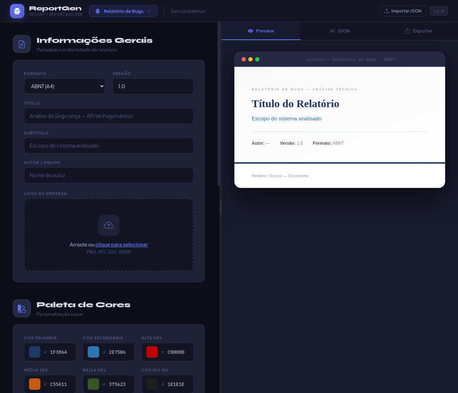
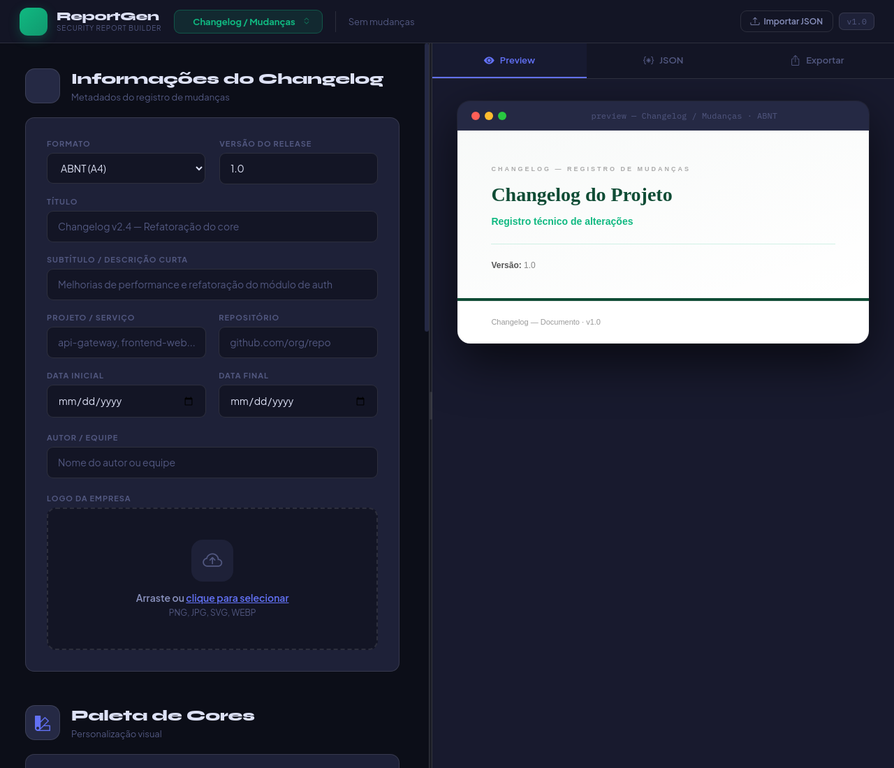

# ReportGen 🚀

**ReportGen** é uma ferramenta web moderna e intuitiva desenvolvida em **React** para a criação de relatórios técnicos profissionais. Focada em segurança da informação e desenvolvimento de software, a ferramenta permite gerar documentos estruturados como Relatórios de Bugs e Changelogs de forma rápida e padronizada.



---

## ✨ Funcionalidades Principais

O ReportGen oferece dois templates principais, cada um com campos específicos e personalização visual:

### 🛡️ Relatório de Bugs (Security Report)

Ideal para profissionais de segurança e QA documentarem vulnerabilidades e achados técnicos de segurança. Permite a criação de relatórios detalhados com formatação ABNT, classificação de severidade (Alta, Média, Baixa) e inclusão de blocos de código para contextualização técnica.


### 📝 Changelog / Mudanças

Perfeito para equipes de desenvolvimento registrarem a evolução de seus projetos. Este template facilita a categorização de mudanças (feat, fix, breaking, refactor, perf, style, chore), o controle de versão e a documentação do impacto e motivação de cada alteração, incluindo diferenciais de código (antes e depois).



---

## 🛠️ Tecnologias Utilizadas

O projeto foi construído utilizando as melhores práticas do ecossistema React moderno:

*   **[React 19](https://react.dev/):** Biblioteca principal para construção da interface de usuário.
*   **[Vite](https://vitejs.dev/):** Ferramenta de build ultra-rápida para o desenvolvimento frontend, garantindo uma experiência de desenvolvimento ágil.
*   **[Bootstrap Icons](https://icons.getbootstrap.com/):** Conjunto de ícones consistente e leve, utilizado para enriquecer a interface visual.
*   **CSS Custom Properties:** Implementação de um sistema de temas dinâmico, incluindo um Dark Mode nativo, para personalização visual.
*   **JSON Import/Export:** Funcionalidade que oferece portabilidade total dos dados do relatório, permitindo salvar e carregar configurações facilmente.

---

## 🚀 Como Começar

### Pré-requisitos

Certifique-se de ter o [Node.js](https://nodejs.org/) instalado em sua máquina, que inclui o npm (Node Package Manager).

### Instalação

1.  Clone o repositório:
    ```bash
    git clone https://github.com/LeoGotardo/reportGen.git
    ```
2.  Acesse o diretório do projeto:
    ```bash
    cd reportGen
    ```
3.  Instale as dependências:
    ```bash
    npm install
    ```

### Desenvolvimento

Para rodar o projeto localmente em modo de desenvolvimento:

```bash
npm run dev
```

O aplicativo estará disponível em `http://localhost:5173` (ou outra porta disponível, caso a 5173 esteja em uso).

### Build

Para gerar a versão de produção do aplicativo:

```bash
npm run build
```

---

## 📂 Estrutura do Projeto

```text
reportGen/
├── public/          # Ativos estáticos (imagens, ícones, etc.)
├── src/             # Código fonte da aplicação React
│   ├── assets/      # Imagens e SVGs específicos da aplicação
│   ├── App.jsx      # Componente principal da aplicação e lógica de negócio
│   ├── App.css      # Estilização global e variáveis CSS
│   └── main.jsx     # Ponto de entrada da aplicação (renderização do React)
├── .eslintrc.js     # Configuração do ESLint para padronização de código
├── index.html       # Template HTML principal da aplicação
├── package.json     # Metadados do projeto, scripts e lista de dependências
├── package-lock.json# Bloqueio de versões das dependências
└── vite.config.js   # Configuração do Vite para o processo de build
```

---

## 💡 Como Usar

1.  **Selecione o Template:** No cabeçalho da aplicação, escolha entre "Relatório de Bugs" ou "Changelog" para iniciar.
2.  **Preencha as Informações:** Utilize o painel de edição à esquerda para inserir todos os dados relevantes do seu relatório.
3.  **Visualize em Tempo Real:** O painel à direita exibe uma pré-visualização dinâmica do relatório, mostrando como ele ficará após a exportação.
4.  **Personalize:** Altere cores, adicione logotipos e ajuste títulos conforme a necessidade do seu documento.
5.  **Exporte:** Salve seu progresso a qualquer momento exportando o JSON do relatório. Utilize a função de impressão/exportação para gerar o documento final em PDF ou outros formatos suportados pelo navegador.

---

## 📄 Licença

Este projeto está sob a licença MIT. Para mais detalhes, consulte o arquivo [LICENSE](LICENSE) (se disponível no repositório).

---

Desenvolvido com ❤️ por [Leo Gotardo](https://github.com/LeoGotardo)
